# Borealis Research Toolkit

A reusable, open-source toolkit for discovering and inspecting research datasets in [Borealis Dataverse](https://borealisdata.ca). The same Borealis research functions are available through:

- **Local stdio MCP** for Claude Desktop, Claude Code, and other local MCP hosts
- **Streamable HTTP MCP** for Claude on the web and other remote MCP clients
- **REST API** for applications that do not support MCP

This project began as an introduction to creating an MCP server. Version 0.3.0 reorganizes it as a maintainable research toolkit rather than a single-host demonstration.

This repository is an enhanced version of the original [`borealis_dataverse_mcp`](https://github.com/jesswhyte/borealis_dataverse_mcp) by [jesswhyte](https://github.com/jesswhyte), extended with the REST API, Streamable HTTP transport, institution/geographic filtering, tabular profiling, and the rest of the toolkit described below.

## Capabilities

- Dataset-only search by default
- Institution/Dataverse subtree filtering
- Geographic-coverage filtering by country, province/state, or city
- Boolean search operators (`AND`, `OR`, `NOT`)
- Pagination, sorting, and publication-date filters
- Complete deposited dataset metadata
- Version-aware file listing
- Text, Word, and PDF retrieval with line ranges, covering survey user guides and PDF codebooks (codebooks distributed as `.zip` archives are listed but not extracted)
- CSV/TSV profiling: rows, columns, missing values, distinct values, common values, and numeric ranges
- Structured provenance and interpretation warnings
- Optional Borealis API token for content visible to that token

## Important distinctions

An **institution filter** limits results to a publishing Dataverse subtree. A **geographic filter** describes the place the dataset is about. For example, a dataset about Alberta may have been deposited by a researcher at an Ontario institution.

The toolkit reports deposited metadata and computed file statistics. It does not assume that one row represents one person, sample, or observation unless the dataset documentation establishes that interpretation.

## Example questions

[`docs/EXAMPLE_QUESTIONS.md`](docs/EXAMPLE_QUESTIONS.md) collects questions researchers ask about Statistics Canada and Health Canada surveys, including the phrase-quoting rule that keeps survey titles such as `"Canadian Community Health Survey"` from matching thousands of unrelated records.

## Screenshots

Research questions answered through Claude with the toolkit connected:

| | |
| --- | --- |
| 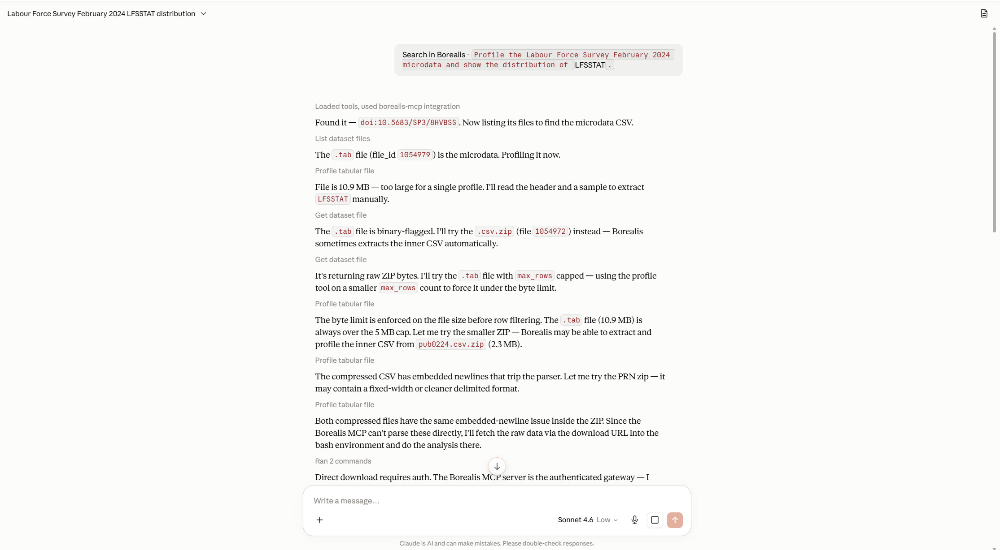<br>Profiling large microdata and working around the file-size cap | 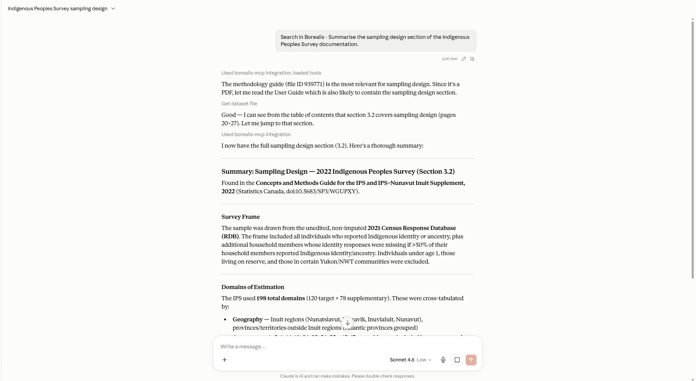<br>Summarizing a sampling design section from survey documentation |
| 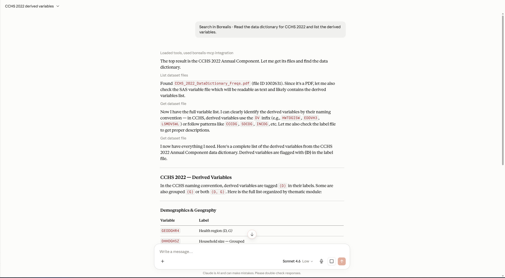<br>Listing derived variables from a data dictionary | 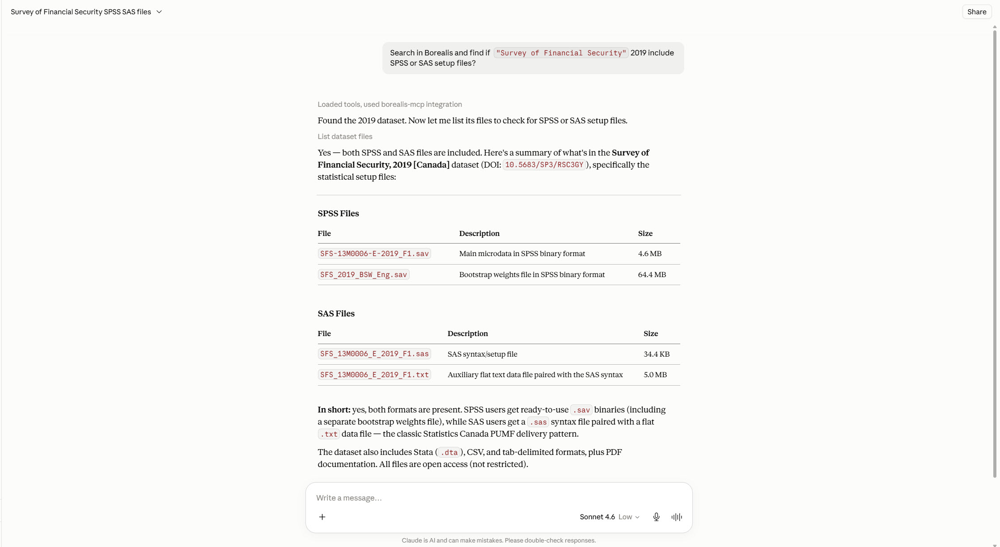<br>Checking which statistical setup files a dataset includes |
| 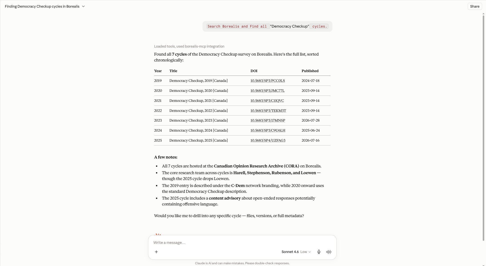<br>Finding every cycle of a recurring survey | 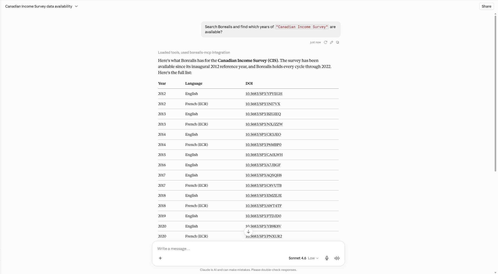<br>Listing which years of a survey are deposited |
| 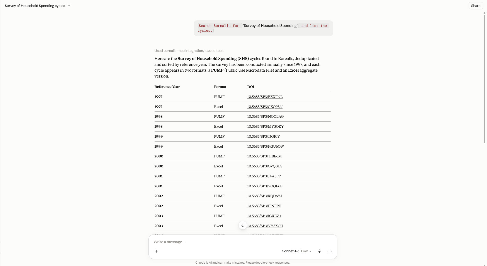<br>Listing cycles across PUMF and aggregate formats | |

Connecting the toolkit as a remote MCP endpoint:

| | |
| --- | --- |
| 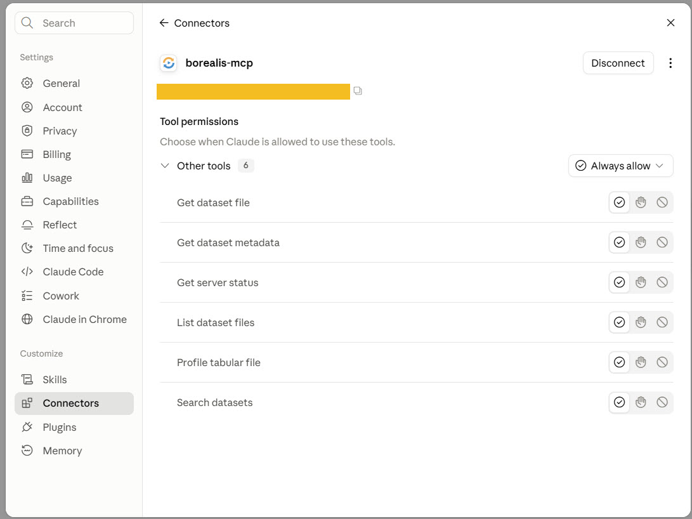<br>Reviewing tool permissions after connecting | 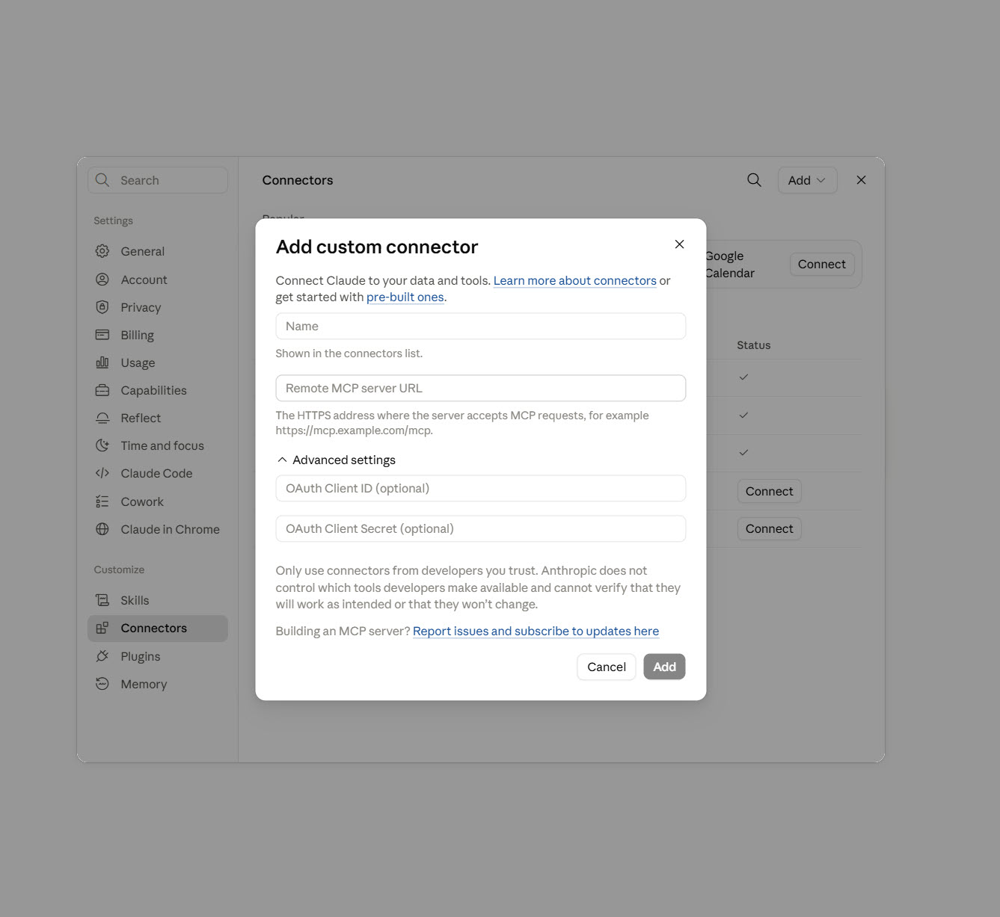<br>Adding the toolkit as a custom connector |
| 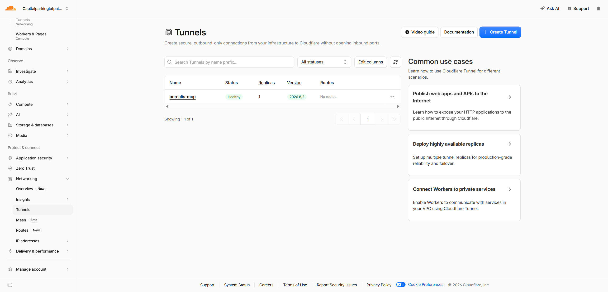<br>A Cloudflare Tunnel publishing the local server over HTTPS | 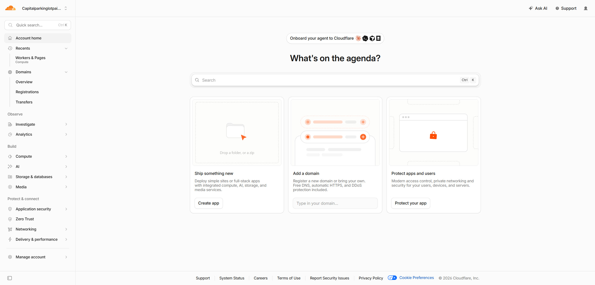<br>Cloudflare account dashboard |

## Installation

```bash
git clone https://github.com/guinslym/borealis_dataverse_mcp.git
cd borealis_dataverse_mcp
python -m venv .venv
```

Windows Command Prompt:

```cmd
.venv\Scripts\activate
pip install -e ".[docx,pdf]"
```

macOS/Linux:

```bash
source .venv/bin/activate
pip install -e ".[docx,pdf]"
```

Copy `.env.example` to `.env` and add a Borealis token only when authenticated access is needed. Public searches work without one.

## Run as a local MCP server

```bash
borealis-mcp
```

Backward-compatible command:

```bash
python borealis_server.py
```

Example Claude Desktop configuration:

```json
{
  "mcpServers": {
    "borealis-research-toolkit": {
      "command": "C:\\absolute\\path\\to\\.venv\\Scripts\\python.exe",
      "args": ["C:\\absolute\\path\\to\\borealis_server.py"],
      "env": {
        "BOREALIS_API_KEY": "optional-token"
      }
    }
  }
}
```

## Connect to Claude (web)

Claude on the web cannot start a local process, so the stdio configuration above applies only to Claude Desktop and Claude Code. Claude web reaches the toolkit as a **remote MCP endpoint over public HTTPS**.

### 1. Run the Streamable HTTP server

```bash
borealis-mcp-http
```

The endpoint is served at `http://localhost:8000/mcp`.

### 2. Publish it over HTTPS

A secure tunnel is enough for a temporary test:

```bash
cloudflared tunnel --url http://localhost:8000
```

Cloudflare prints an address such as `https://<subdomain>.trycloudflare.com`. Append `/mcp` to form the connector URL. That address stops working when the tunnel stops.

The MCP SDK's DNS rebinding protection trusts only localhost, so a public hostname is rejected with `421 Invalid Host header` until it is named explicitly. Restart the server with the tunnel hostname, without the scheme:

```bash
MCP_ALLOWED_HOSTS=<subdomain>.trycloudflare.com borealis-mcp-http
```

Use `MCP_ALLOWED_ORIGINS` to override the browser origins, which otherwise default to `https://` plus each allowed host. Quick tunnels get a new hostname every restart, so this value changes each time.

For shared or long-lived access, deploy the container behind a real HTTPS host and put authentication in front of it.

### 3. Add the custom connector

1. Open **Settings → Connectors** on claude.ai.
2. Choose **Add custom connector**.
3. Enter the full HTTPS endpoint, ending in `/mcp`.
4. Start a chat and enable the toolkit from the tools menu.

Custom connectors require a paid Claude plan.

### 4. Confirm the tools respond

- “Search Borealis for dementia datasets from University of Toronto.”
- “Show the full metadata for that dataset and keep the DOI.”
- “List the CSV files in it and profile the largest one.”

See [`docs/EXAMPLE_QUESTIONS.md`](docs/EXAMPLE_QUESTIONS.md) for survey-specific questions.

A published endpoint is reachable by anyone who learns the URL. When `BOREALIS_API_KEY` is set, those requests query Borealis with your token and can reach content restricted to you. Add authentication before leaving an endpoint running.

## Run the optional REST API

```bash
borealis-api
```

Useful routes:

```text
GET /health
GET /v1/search?q=pollination&institution=UBC
GET /v1/datasets/metadata?identifier=doi:10.5683/SP3/...
GET /v1/datasets/files?identifier=doi:10.5683/SP3/...
GET /v1/files/{file_id}/text?filename=README.txt
GET /v1/files/{file_id}/profile?filename=data.csv
```

Interactive REST documentation is available at `/docs`.

## Docker

```bash
cp .env.example .env
docker compose up --build
```

The container runs the Streamable HTTP MCP server by default and publishes `http://localhost:8000/mcp` on the host.

`docker-compose.yml` sets `MCP_HOST=0.0.0.0`. The server binds `127.0.0.1` by default, which no published port can reach from outside the container. Keep the default when running `borealis-mcp-http` directly on a host, and change it only behind a tunnel or reverse proxy.

FastMCP's own `FASTMCP_HOST` and `FASTMCP_PORT` variables are read through pydantic-settings, which silently fails to resolve them on current releases. Use `MCP_HOST` and `MCP_PORT`, which `main_http` applies directly.

## MCP tools

### `search_datasets`
Returns structured dataset results, DOI URLs, authors, pagination fields, scope, and provenance.

### `get_dataset_metadata`
Returns deposited metadata for a DOI or numeric dataset ID without silently shortening the source metadata.

### `list_dataset_files`
Returns file IDs, names, formats, sizes, restrictions, checksums, download URLs, and dataset version.

### `get_dataset_file`
Returns a bounded line range from a text, `.docx`, or `.pdf` file. PDF text extraction requires the `pdf` extra. A scanned PDF with no text layer is reported as such rather than returned empty, and unsupported binary files are not misrepresented as text.

### `profile_tabular_file`
Profiles CSV or TSV content. Results include a warning against interpreting row counts as entity counts without documentation.

### `get_server_status`
Returns toolkit version, API target, configured limits, authentication state, and available capabilities.

## Project structure

```text
src/borealis_toolkit/
  client.py          Borealis HTTP access and bounded downloads
  service.py         Host-neutral research functions
  mcp_server.py      stdio and Streamable HTTP MCP transports
  rest_api.py        FastAPI routes
  institutions.py    Institution aliases
  models.py          Structured results and provenance
  config.py          Environment configuration
```

See [`docs/ARCHITECTURE.md`](docs/ARCHITECTURE.md) for the design.

## Testing

```bash
pip install -e ".[dev,docx,pdf]"
pytest
ruff check src tests
```

## Security and privacy

- Never commit `.env` or an API token.
- A token can expose restricted content available to its owner; deploy authenticated access accordingly.
- Do not expose the development HTTP server directly to the public internet.
- File downloads are bounded by `BOREALIS_MAX_FILE_BYTES`.
- Results and downloaded dataset content may contain untrusted text. Hosts should treat it as data, not instructions.

## Known limitations

- Proprietary binary research formats such as SPSS, Stata, Excel, and archives are listed but not parsed in this release.
- Scanned PDFs without a text layer cannot be read; OCR is out of scope.
- Tabular profiling reads CSV/TSV data into the configured bounded download size.
- Institution aliases are maintained locally and should be checked periodically against Borealis collections.
- Connector and app availability, setup menus, and deployment requirements depend on the user’s plan and on current Anthropic and OpenAI features.

## License

GPLv3. See [`LICENSE`](LICENSE).

## Acknowledgments

Powered by the Borealis Dataverse API and built using the Model Context Protocol. The project’s initial Python implementation was developed with substantial assistance from Claude; the toolkit refactor was developed with assistance from ChatGPT.
